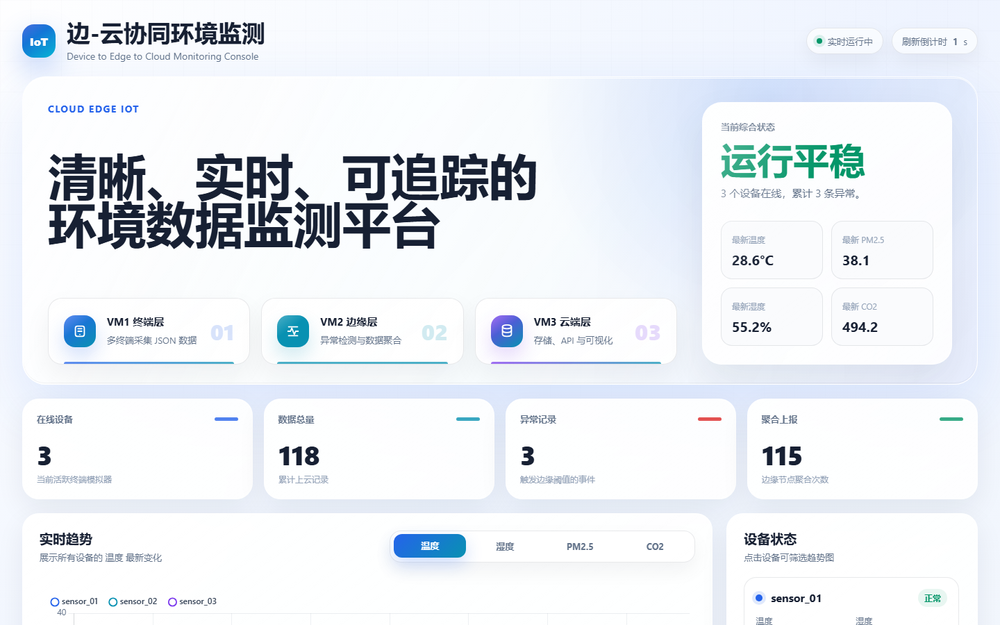

# 边-云协同 IoT 智能环境监测系统

> Edge-Cloud Collaborative IoT Environmental Monitoring System

本项目是《云与边缘计算安全》课程大作业实现：基于 **VM1 终端模拟器 -> VM2 边缘节点 -> VM3 云端平台** 的三层架构，完成环境数据采集、边缘异常检测、聚合转发、云端存储与 Web 可视化展示。



## 项目亮点

- **三层端-边-云结构**：VM1 负责采集模拟，VM2 负责边缘预处理，VM3 负责存储与展示。
- **多终端模拟**：VM1 使用多线程模拟多个 IoT 设备，默认 3 个传感器。
- **边缘智能处理**：VM2 支持 PM2.5 和温度阈值异常检测，异常数据立即上云，正常数据按时间窗口聚合。
- **云端持久化**：VM3 使用 SQLite 存储传感器数据、异常标记和聚合结果。
- **精致 Web 仪表盘**：白色液态玻璃风格控制台，支持实时统计、设备状态、异常事件、温度/湿度/PM2.5/CO2 趋势切换。
- **Docker 化部署**：提供三个模块的 Dockerfile 和 `docker-compose.yml`，可一键启动完整系统。

## 系统架构

```text
VM1 终端层                  VM2 边缘层                  VM3 云端层
多终端采集 JSON 数据   ->   异常检测 + 窗口聚合    ->   SQLite 存储 + Web 仪表盘
Python + Requests          Flask + Requests            Flask + SQLite + Chart.js
```

数据流：

```text
sensor_01 / sensor_02 / sensor_03
        |
        | HTTP POST /api/data
        v
VM2 Edge Server
        |-- 异常数据：立即转发
        |-- 正常数据：定时聚合后转发
        |
        | HTTP POST /api/data
        v
VM3 Cloud Server -> SQLite -> REST API -> Web Dashboard
```

## 快速开始：Docker Compose

在项目根目录执行：

```bash
docker compose up -d --build
```

查看日志：

```bash
docker compose logs -f
```

访问仪表盘：

```text
http://localhost:5000
```

停止服务：

```bash
docker compose down
```

## 三台虚拟机部署

推荐启动顺序：

```text
VM3 云端平台 -> VM2 边缘节点 -> VM1 终端模拟器
```

三台虚拟机需在同一内网，可互相 `ping` 通。完整步骤见 [部署指南.md](部署指南.md)。

### VM3：云端平台

```bash
cd vm3-cloud
pip install -r requirements.txt
python cloud_server.py
```

默认监听：

```text
0.0.0.0:5000
```

浏览器访问：

```text
http://<VM3_IP>:5000
```

### VM2：边缘节点

```bash
cd vm2-edge
pip install -r requirements.txt
export CLOUD_URL=http://<VM3_IP>:5000
export PM25_THRESHOLD=50
export TEMP_THRESHOLD=38
export AGGREGATE_WINDOW=30
python edge_server.py
```

### VM1：终端模拟器

```bash
cd vm1-terminal
pip install -r requirements.txt
export EDGE_URL=http://<VM2_IP>:5000
export DEVICE_COUNT=3
export SAMPLE_INTERVAL=5
python sensor_simulator.py
```

## 配置参数

| 变量 | 默认值 | 所属模块 | 说明 |
|------|--------|----------|------|
| `DEVICE_COUNT` | `3` | VM1 | 模拟终端数量 |
| `SAMPLE_INTERVAL` | `5` | VM1 | 采集间隔，单位秒 |
| `EDGE_URL` | `http://vm2-edge:5000` | VM1 | 边缘节点地址 |
| `CLOUD_URL` | `http://vm3-cloud:5000` | VM2 | 云端平台地址 |
| `PM25_THRESHOLD` | `50` | VM2 | PM2.5 异常阈值 |
| `TEMP_THRESHOLD` | `38` | VM2 | 温度异常阈值 |
| `AGGREGATE_WINDOW` | `30` | VM2 | 正常数据聚合窗口，单位秒 |
| `DATABASE_PATH` | `data/iot_data.db` | VM3 | SQLite 数据库路径 |

## 功能模块

### VM1 终端模拟器

文件：`vm1-terminal/sensor_simulator.py`

- 多线程模拟多个 IoT 设备。
- 定时生成 JSON 格式环境数据。
- 数据字段包括 `device_id`、`timestamp`、`temperature`、`humidity`、`pm25`、`co2`。
- 使用 HTTP POST 发送到 VM2 的 `/api/data`。

### VM2 边缘预处理

文件：`vm2-edge/edge_server.py`

- 提供 `POST /api/data` 接口接收终端数据。
- 校验上报数据格式。
- 根据 PM2.5 和温度阈值判断异常。
- 异常数据立即转发云端。
- 正常数据写入缓冲区，每 `AGGREGATE_WINDOW` 秒按设备聚合并转发。

### VM3 云端平台

文件：`vm3-cloud/cloud_server.py`

- 提供 `POST /api/data` 接口接收边缘数据。
- 使用 SQLite 持久化存储。
- 提供统计、设备列表、最新数据等 REST API。
- 提供白色液态玻璃风格 Web 仪表盘。

主要 API：

```text
GET  /
POST /api/data
GET  /api/stats
GET  /api/devices
GET  /api/data/latest?limit=100
```

## 实验验证建议

### 1. 网络互通验证

在 VM1 上执行：

```bash
ping -c 3 <VM2_IP>
ping -c 3 <VM3_IP>
```

### 2. 正常数据流验证

依次启动 VM3、VM2、VM1 后观察：

- VM1 日志出现 `sensor_01`、`sensor_02`、`sensor_03` 周期性发送数据。
- VM2 日志出现 `[接收] 正常` 和 `[聚合转发]`。
- VM3 日志出现 `[存储] 聚合`。
- 仪表盘统计卡、趋势图、设备状态逐步更新。

### 3. 异常检测验证

可临时降低 VM2 阈值：

```bash
export PM25_THRESHOLD=20
export TEMP_THRESHOLD=30
python edge_server.py
```

预期结果：

- VM2 日志出现 `[接收] 异常` 和 `[异常转发]`。
- VM3 日志出现 `[存储] 异常`。
- Web 仪表盘出现异常事件和红色异常点。

### 4. API 验证

在 VM3 执行：

```bash
curl http://127.0.0.1:5000/api/stats
curl http://127.0.0.1:5000/api/devices
curl "http://127.0.0.1:5000/api/data/latest?limit=5"
```

## 实验报告截图建议

建议至少准备以下截图：

1. 三台虚拟机 IP 地址与网络互通截图。
2. 项目源码目录结构截图。
3. VM3 云端平台启动截图。
4. VM2 边缘节点启动截图。
5. VM1 多终端模拟采集日志截图。
6. VM2 正常接收、异常检测、聚合转发日志截图。
7. VM3 云端存储日志截图。
8. Web 仪表盘总览截图。
9. 温度、湿度、PM2.5、CO2 趋势切换截图。
10. 异常事件列表与红色异常点截图。
11. REST API `curl` 验证截图。
12. Docker Compose 启动与 `docker compose ps` 截图。

## 目录结构

```text
cloud-edge-iot/
├── docker-compose.yml
├── README.md
├── 部署指南.md
├── 实验报告.md
├── docs/
│   └── dashboard.png
├── vm1-terminal/
│   ├── sensor_simulator.py
│   ├── config.py
│   ├── Dockerfile
│   └── requirements.txt
├── vm2-edge/
│   ├── edge_server.py
│   ├── config.py
│   ├── Dockerfile
│   └── requirements.txt
└── vm3-cloud/
    ├── cloud_server.py
    ├── config.py
    ├── Dockerfile
    ├── requirements.txt
    ├── static/
    │   └── dashboard.js
    └── templates/
        └── dashboard.html
```
